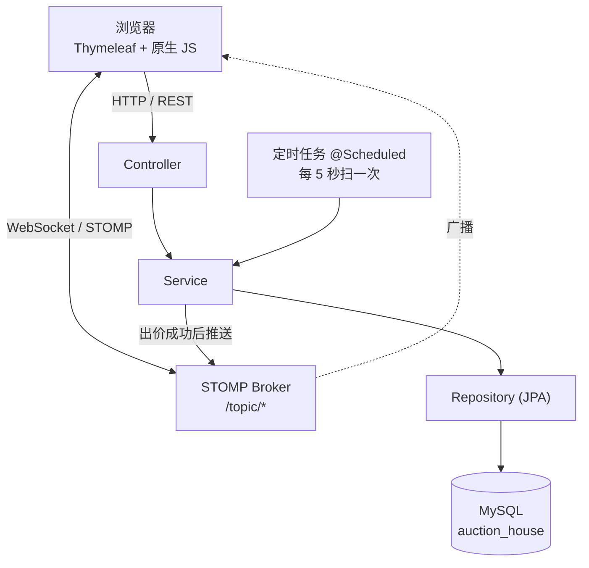
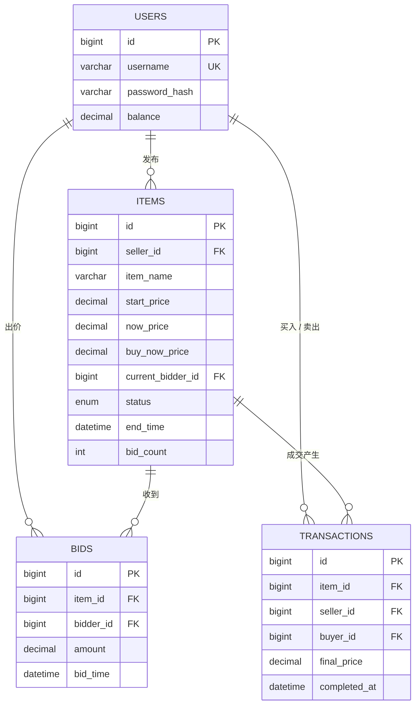

# 实时拍卖行系统

一个支持实时竞价的在线拍卖平台。玩家上架物品并设置起拍价与时长，其他玩家在网页上实时出价；出价通过 WebSocket 推送给所有围观者；结束前 2 分钟内有人出价则自动延长结束时间；到期由定时任务自动结算，完成资金转移与物品过户。

核心难点：**多个人同时抢同一个物品时，系统不能算错钱、不能出现两个赢家。**

## 技术栈

| 类别 | 选型 |
| --- | --- |
| 语言 / 运行时 | Java 25 |
| 框架 | Spring Boot 4.1.0（Spring MVC + Spring Data JPA） |
| 数据库 | MySQL 8.0 |
| 模板引擎 | Thymeleaf |
| 实时通信 | Spring WebSocket + STOMP（SockJS 降级） |
| 密码存储 | BCrypt（`spring-security-crypto`） |
| 构建 | Maven |

## 系统结构



## 数据模型



设计说明：

- `now_price` / `bid_count` 是**冗余字段**，直接存在 `items` 上。列表页展示当前价与热度时无需查询 `bids` 表排序或 `COUNT(*)`；读多写少的场景下，以写入时多计算一次换取读取时少查询一次。
- 所有金额使用 `DECIMAL` 而不是 `FLOAT` / `DOUBLE`，避免二进制浮点无法精确表示小数导致的金额误差。
- `current_bidder_id` 与 `buy_now_price` 允许为 `NULL`，分别表示尚未有人出价与卖家未设置一口价。

## 功能

- **用户系统**：注册、登录、登出；密码经 BCrypt 哈希存储；基于 HttpSession 维持登录态
- **发布拍卖**：设置物品名称、描述、起拍价、可选一口价与拍卖时长
- **拍卖大厅**：分页展示进行中的拍卖，支持按物品名称搜索；按结束时间升序排列，即将结束的在前
- **出价**：校验拍卖状态、出价金额、卖家不能自出价、不能连续顶价、余额是否充足
- **防狙击延时**：结束前 2 分钟内有人出价，自动将结束时间延后 2 分钟；单场最多延时 5 次，避免无上限时拍卖无法结束
- **一口价买断**：出价达到卖家设定的一口价时，按一口价立即成交
- **取消拍卖**：仅卖家本人可取消，且必须尚无人出价
- **自动结算**：定时任务每 5 秒扫描到期拍卖，扣减买家余额、增加卖家余额、生成成交记录并变更物品状态
- **实时推送**：出价、被超越、拍卖结束三类事件通过 WebSocket 推送至浏览器
- **登录拦截**：未登录访问发布页或「我的拍卖」时重定向至登录页

## 本地运行

**前置条件**：JDK 25、MySQL 8.0、Maven

1. 创建数据库

   ```sql
   CREATE DATABASE auction_house DEFAULT CHARACTER SET utf8mb4;
   ```

2. 修改 `src/main/resources/application.properties` 中的数据库账号密码

3. 启动

   ```bash
   mvn spring-boot:run
   ```

   表结构由 JPA 根据实体自动创建（`spring.jpa.hibernate.ddl-auto=update`）。

4. 打开 `http://localhost:8080`

## 接口一览

### 页面路由

| 方法 | 路径 | 说明 |
| --- | --- | --- |
| GET | `/` | 首页 |
| GET | `/register` `/login` | 注册 / 登录页 |
| GET | `/auctions` | 拍卖大厅 |
| GET | `/auctions/{id}` | 拍卖详情 |
| GET | `/auctions/create` | 发布拍卖（需登录） |
| GET | `/my/auctions` | 我的拍卖（需登录） |

### REST API

| 方法 | 路径 | 说明 |
| --- | --- | --- |
| POST | `/api/users/register` | 注册 |
| POST | `/api/users/login` | 登录 |
| POST | `/api/users/logout` | 登出 |
| GET | `/api/users/me` | 当前登录用户与余额 |
| GET | `/api/auctions` | 拍卖列表，支持 `keyword` `page` `size` |
| GET | `/api/auctions/{id}` | 拍卖详情 |
| POST | `/api/auctions` | 创建拍卖 |
| POST | `/api/auctions/{id}/cancel` | 取消拍卖 |
| GET | `/api/auctions/mine` | 我发布的拍卖 |
| POST | `/api/auctions/{id}/bid` | 出价 |
| GET | `/api/auctions/{id}/bids` | 某场拍卖的出价记录 |
| GET | `/api/auctions/my/bids` | 我的出价记录 |

统一响应格式：

```json
{ "code": 200, "message": "ok", "data": { } }
```

### WebSocket

- 连接端点：`/ws`（SockJS）
- 订阅 `/topic/auction/{itemId}` 接收：`NEW_BID`（有人出价）、`AUCTION_ENDED`（拍卖结束）
- 订阅 `/topic/auction/{itemId}/user/{userId}` 接收：`OUTBID`（自己被超越）

## 几个设计上的取舍

### 并发出价的锁粒度

同一场拍卖必须串行处理。若两个线程同时读到当前价 100，分别出价 110 与 120，后写的事务会覆盖先写的，最终当前价可能停在 110，而两条出价记录都已落库，数据自相矛盾。

若将 `synchronized` 加在 `placeBid` 方法上，锁对象为整个 Service 实例，**不同拍卖之间也会互相阻塞**。本项目使用 `ConcurrentHashMap<Long, Object>` 为每场拍卖分配独立的锁对象：

```java
synchronized (lockRegistry.lockFor(itemId)) {
    // 校验 → 落库 → 改价 → 推送
}
```

同一场拍卖串行、不同拍卖并行。结算流程使用**同一把锁**，因此「出价」与「结算」天然互斥，无需额外的协调机制。

### 推送为什么放在锁内

`convertAndSend` 仅将消息投递给本进程内的 broker，真正的网络发送由 broker 的线程池异步完成，因此在锁内调用它不会等待网络。

放在锁内保证两点：

1. **消息顺序与出价顺序一致**。若放在锁外，线程 A 出价后被调度器挂起，线程 B 出价后先推送，A 恢复后才推送，客户端会看到价格从 120 跳回 110。
2. **读取的数据是本次出价的快照**。出锁后再读 `item`，可能已被下一次出价改写，推送消息中的价格与次数不一致。

### 结算推送为什么由调用方做

`settleOne` 标注了 `@Transactional`，而 Spring 的事务在**方法返回之后才提交**。若在 `settleOne` 内部推送，推送时事务尚未提交；一旦后续回滚，客户端会收到错误的成交通知。

因此 `settleOne` 改为**返回**待广播的消息，由调用方在事务外发送。

### 一口价为什么复用结算流程

一口价买断需要「扣款、入账、生成成交记录、变更状态」这一整套动作，与定时结算完全一致。若单独实现一份，资金转移逻辑将存在两份，各自都有出错的可能。

本项目的做法是：买家出价达到一口价时，将成交价记为一口价，并把 `endTime` 直接改为当前时间，由下一轮定时任务（最多 5 秒后）执行正常的结算流程。代价是成交存在延迟，收益是资金转移逻辑只有一份。

## 测试

```bash
mvn test
```

| 测试类 | 覆盖内容 |
| --- | --- |
| `BidServiceImplTest` | 出价的 6 条单线程校验规则：正常出价、金额不足、余额不足、卖家自出价、连续顶价、拍卖已结束 |
| `BidConcurrencyTest` | 50 个线程同时对同一场拍卖出价，断言无丢更新、冗余字段与真实记录一致 |
| `AuctionSettlementTest` | 结算的 5 个分支：成交、无人出价流拍、买家余额不足流拍、未到期不结算、重复结算只扣一次款 |
| `AntiSnipeExtendTest` | 防狙击延时的上限：前 5 次各延后 2 分钟，第 6 次不再延后，且出价本身照常成功 |
| `SettlementSchedulerDisabledTest` | 验证测试环境下定时结算调度器处于关闭状态 |

合计 17 个测试。

测试使用独立的 `auction_house_test` 库，与开发库隔离。首次运行前需创建：

```sql
CREATE DATABASE auction_house_test DEFAULT CHARACTER SET utf8mb4;
```

测试专用的配置项（调度器开关、连接池大小、独立数据源）及其原因见 `src/test/resources/application-test.properties` 中的注释。

## 还没有做的

- 测试覆盖不完整：UserService / ItemService 无测试，一口价买断路径无测试，结算与出价的竞态测试未写，无 Controller 集成测试
- 部署上线
- 「我的出价」「个人信息」页面
- 出价时的余额冻结。当前在结算阶段才检查余额，存在「出价时充足、结算时不足」的窗口；该窗口在 `AuctionSettlementTest` 中已被显式覆盖
- 分布式部署下的锁方案。当前锁仅在单机内有效
- 前端公共片段抽取。导航栏目前在 7 个模板中重复实现
